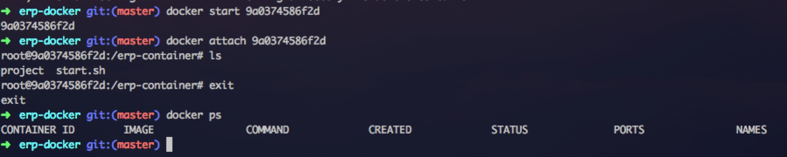
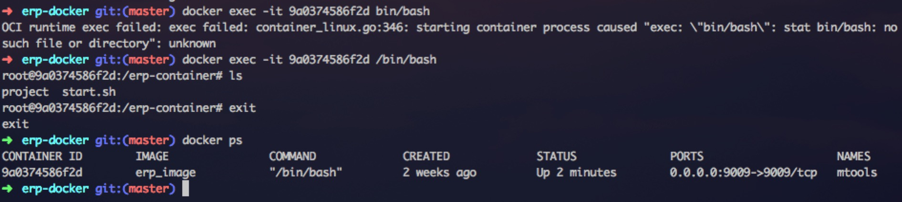
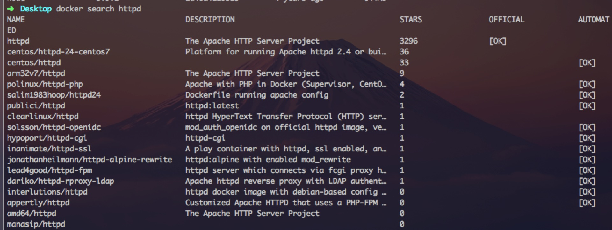

## 常用命令
---

| 命令 | 描述 |
| --- | --- |
| `docker` | 列出所有命令 |
| `docker ps --help` | 查看ps指令的具体用法 |

### 容器的使用
---
#### 查看容器
默认查看正在运行容器, -a看全部
```sh
docker ps 
-a, --all             Show all containers (default shows just running)

查看容器的ip地址
docker inspect --format '{{ .NetworkSettings.IPAddress }}' 0c6268e6ff1b
```

#### 启动容器
1. 使用ubuntu镜像启动一个容器

```sh
docker run -it --name ubuntu-test ubuntu /bin/bash
```

参数说明：
- `-i`: 交互式操作.
- `-t`: 终端.
- `-d`: 参数默认不会进入容器，想要进入容器需要使用指令 docker exec.
- `--name`: 给容器命名ubuntu-test
- `ubuntu`: ubuntu 镜像.
- `/bin/bash`：放在镜像名后的是命令，这里我们希望有个交互式 Shell，因此用的是 `/bin/bash`.

2. 启动已停止的容器

`docker start CONTAINER_ID`
```sh
docker ps
CONTAINER ID        IMAGE               COMMAND             CREATED             STATUS              PORTS                    NAMES
9a0374586f2d        erp_image           "/bin/bash"         2 weeks ago         Up 15 hours         0.0.0.0:9009->9009/tcp   mtools

docker start 9a0374586f2d
```
#### 停止一个容器
`docker stop 容器id`
#### 重启一个容器
停止的容器可以重启
`docker restart 容器id`
#### 进入容器
`docker attach`

`docker exec`: 推荐大家使用 docker exec 命令，因为此退出容器终端，不会导致容器的停止。


#### Docker容器连接
前面我们实现了通过网络端口来访问运行在`docker`容器内的服务.
容器中可以运行一些网络应用,要让外部也可以访问这些应用,可以通过`-P`或`-p`参数来指定端口映射.
下面我们来实现通过端口连接到一个`docker`容器.
`docker run -it --name=$1 -v $(pwd)/project:/docker-work/project -p $2:$2 --entrypoint /bin/bash old-project`

- `-v 本机目录:容器目录`: 共享本机的文件,本机或者容器内修改了该目录都会同步.
- `-p 本机端口号:容器端口号`: 映射容器端口号到本机端口号
- `--entrypoint`: 覆盖入口点,以old-project镜像去运行/bin/bash 

#### 退出容器
`exit`
退出后容器是否后台运行, 取决于怎么进入. 如果是attach,exit退出后容器不会在后台运行. 如果是exec进入则会在后台运行,不会关闭容器.
#### 删除容器
`docker rm -f 容器id`

### 镜像的使用
---

#### 查看镜像

`docker images`

```sh
docker images

REPOSITORY          TAG                 IMAGE ID            CREATED             SIZE
erp_image           latest              b5d169ff00e4        2 weeks ago         658MB
node                5.9.1               1d40a411bb29        4 years ago         644MB
```
各个选项说明:
- REPOSITORY：表示镜像的仓库源
- TAG：镜像的标签
- IMAGE ID：镜像ID
- CREATED：镜像创建时间
- SIZE：镜像大小
同一仓库源可以有多个 TAG，代表这个仓库源的不同个版本，如 ubuntu 仓库源里，有 15.10、14.04 等多个不同的版本，我们使用 REPOSITORY:TAG 来定义不同的镜像。
所以，我们如果要使用版本为15.10的ubuntu系统镜像来运行容器时，命令如下：
`docker run -t -i ubuntu:15.10 /bin/bash`
如果你不指定一个镜像的版本标签，例如你只使用 ubuntu，docker 将默认使用 ubuntu:latest 镜像。

#### 获取镜像
```sh
下载ubuntu镜像
docker pull ubuntu:13.10
```
下载完成后，我们可以直接使用这个镜像来运行容器。
#### 查找镜像
我们可以从 Docker Hub 网站来搜索镜像，Docker Hub 网址为: [Docker Hub](https://hub.docker.com/)
我们也可以使用 docker search 命令来搜索镜像。比如我们需要一个 httpd 的镜像来作为我们的 web 服务。我们可以通过 docker search 命令搜索 httpd 来寻找适合我们的镜像。
`docker search httpd`



- NAME: 镜像仓库源的名称
- DESCRIPTION: 镜像的描述
- OFFICIAL: 是否 docker 官方发布
- stars: 类似 Github 里面的 star，表示点赞、喜欢的意思。
- AUTOMATED: 自动构建。

#### 删除镜像
强制删除本地镜像 runoob/ubuntu:v4.
`docker rmi -f runoob/ubuntu:v4`

- `-f`: 强制删除

```sh
root@runoob:~# docker rmi -f runoob/ubuntu:v4
Untagged: runoob/ubuntu:v4
Deleted: sha256:1c06aa18edee44230f93a90a7d88139235de12cd4c089d41eed8419b503072be
Deleted: sha256:85feb446e89a28d58ee7d80ea5ce367eebb7cec70f0ec18aa4faa874cbd97c73
```

#### 创建镜像
当我们从 docker 镜像仓库中下载的镜像不能满足我们的需求时，我们可以通过以下两种方式对镜像进行更改。
1. 从已经创建的容器中更新镜像，并且提交这个镜像
2. 使用 Dockerfile 指令来创建一个新的镜像

##### 更新镜像

##### 构建新镜像
使用命令`docker build`,从零开始来创建一个新的镜像.为此,我们需要创建一个**Dockerfile**文件，其中包含一组指令来告诉**Docker**如何构建我们的镜像.
```docker
# Dockerfile 安装需要的依赖, 此文件只有在构建镜像时使用
# node version
FROM node:5.9.1

# 容器工作空间目录
WORKDIR /erp-container

# 将host start.sh拷贝到容器
COPY start.sh .

# 在容器中创建project目录, 此目录将会绑定host的project目录
RUN mkdir project

# 容器中安装全局gulp
RUN npm install -g gulp@3.9.0
```
每一个指令都会在镜像上创建一个新的层,每一个指令的前缀都必须是大写的.
第一条FROM,指定使用哪个镜像源
RUN 指令告诉docker在镜像内执行命令,安装了什么...
然后，我们使用**Dockerfile**文件,通过`docker build`命令来构建一个镜像.
```sh
#!/bin/sh
# 构建本地镜像, 这里统一命名为erp_image

docker build -t erp_image .
```
参数说明:
- `-t`: 指定要创建的目标镜像名
- `.`: **Dockerfile**文件所在目录,可以指定**Dockerfile**的绝对路径

#### 设置镜像标签
我们可以使用`docker tag`命令,为镜像添加一个新的标签
```sh
runoob@runoob:~$ docker tag 860c279d2fec runoob/centos:dev
```
docker tag 镜像ID,这里是860c279d2fec,用户名称,镜像源名(repository name)和新的标签名(tag).
使用 docker images 命令可以看到，ID为860c279d2fec的镜像多一个标签。

## 相关问题
1. 无法连接容器

端口映射后本地localhost:9000,仍然访问不到.是容器内服务用的localhost,127.0.0.1等环回地址(只有容器内能访问).
[了解127.0.0.1和0.0.0.0](https://juejin.cn/post/6844904138812162061)

## 相关链接
[Docker —— 从入门到实践](https://yeasy.gitbook.io/docker_practice/)
