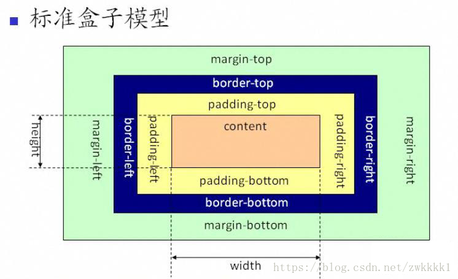
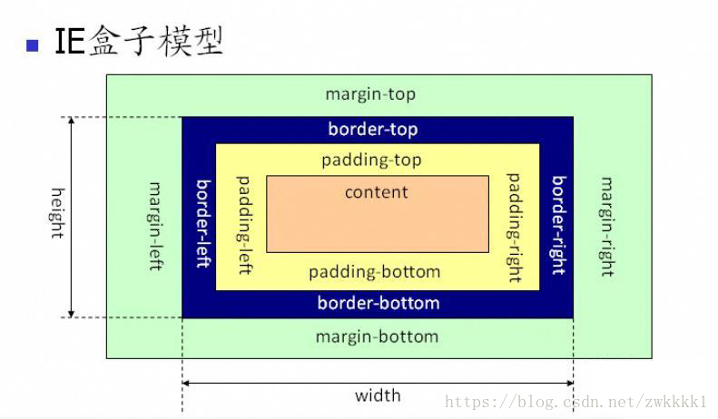

## 数组扁平化
---

`const arr = [1, [2, [3, [4, 5]]], 6];`
### 1.flat

```js
const res = arr.flat(Infinity);
```
### 2.正则

```js
const res = JSON.stringify([1, [2, [3, [4, 5]]], 6]).replace(/\[|\]/g, '').split(',');
```

但是数据类型都会变为字符串

### 3.正则改良版

```js
const res = JSON.parse('[' + JSON.stringify(arr).replace(/\[|\]/g, '') + ']');
```
### 4.使用reduce

```js
const flatten = arr => {
    return arr.reduce((pre, cur) => {
        return pre.concat(Array.isArray(cur) ? flatten(cur) :  cur);
    }, [])
}
const res = flatten(arr);

```
### 5.函数递归

```js
const res = [];
const fn = arr => {
    for(let i = 0; i < arr.length; i++) {
        if(Array.isArray(arr[i])) {
            fn(arr[i]);
        } else {
            res.push(arr[i]);
        }
    }
}
fn(arr);
```
## 数组去重
---

`const arr = [1, 1, '1', 17, true, true, false, false, 'true', 'a', {}, {}];`

### 1.利用Set

```js
let res = Array.from(new Set(arr));
```
### 2.两层for循环+splice

```js
let arr = [1, 1, '1', 17, true, true, false, false, 'true', 'a', {}, {}];
let unique = arr => {
    let len = arr.length;
    for(let i = 0; i < len; i++) {
        for(let j = i + 1; j <len; j++) {
            if(arr[i] === arr[j]) {
                arr.splice(j, 1);
                // 每删除一个数,j--保证j的值经过自加后不变.同时,len--,减少循环次数提升性能
                len--;
                j--;
            }
        }
    }
    return arr;
}
unique(arr);
```

### 3.利用indexOf

```js
let arr = [1, 1, '1', 17, true, true, false, false, 'true', 'a', {}, {}];
let unique = arr => {
    let res = [];
    for(let i = 0; i < arr.length; i++) {
        if(res.indexOf(arr[i]) <= -1) {
            res.push(arr[i]);
        }
    }
    return res;
}
unique(arr);
```
当然也可以用include,filter,思路大同小异.
### 4.利用include

```js
let unique = arr => {
  const res = [];
  for (let i = 0; i < arr.length; i++) {
    if (!res.includes(arr[i])) res.push(arr[i]);
  }
  return res;
}
```
### 5.利用filter

```javascript
let unique = arr => {
  return arr.filter((item, index) => {
    return arr.indexOf(item) === index;
  });
}
```
### 6.利用Map

```js
let unique = arr => {
  const map = new Map();
  const res = [];
  for (let i = 0; i < arr.length; i++) {
    if (!map.has(arr[i])) {
      map.set(arr[i], true);
      res.push(arr[i]);
    }
  }
  return res;
}
```

## 类数组转化为数组
---

类数组是具有length属性,但不具有数组原型上的方法.常见的类数组有arguments,DOM操作方法返回的结果.
### 1.Array.from

```js
Array.from(document.querySelectorAll('div'));
```

### 2.Array.prototype.slice.call()

```js
Array.prototype.slice.call(document.querySelectorAll('div'));
```

### 3.扩展运算符

```js
[...document.querySelectorAll('div')];
```

### 4.利用concat

```js
Array.prototype.concat.apply([], document.querySelectorAll('div'));
```

## Array.prototype.filter()
---

```js
Array.prototype.filter = function(callback, thisArg) {
  if (this == undefined) {
    throw new TypeError('this is null or not undefined');
  }
  if (typeof callback !== 'function') {
    throw new TypeError(callback + 'is not a function');
  }
  const res = [];
  // 让O成为回调函数的对象传递(强制转换对象)
  const O = Object(this);
  // >>>0 保证len为number,且为正整数
  const len = O.length >>> 0;
  for (let i = 0; i < len; i++) {
    // 检查i是否在O的属性(会检查原型链)
    if (i in O) {
      // 回调函数调用传参
      if (callback.call(thisArg, O[i], i, O)) {
        res.push(O[i]);
      }
    }
  }
  return res;
}
```
对于`>>>0`有疑问的:  [解释>>>0的作用](https://zhuanlan.zhihu.com/p/100790268)
## Array.prototype.map()
---

```js
Array.prototype.map = function(callback, thisArg) {
  if (this == undefined) {
    throw new TypeError('this is null or not defined');
  }
  if (typeof callback !== 'function') {
    throw new TypeError(callback + ' is not a function');
  }
  const res = [];
  // 同理
  const O = Object(this);
  const len = O.length >>> 0;
  for (let i = 0; i < len; i++) {
    if (i in O) {
      // 调用回调函数并传入新数组
      res[i] = callback.call(thisArg, O[i], i, this);
    }
  }
  return res;
}
```

## Array.prototype.forEach()
---
`forEach`跟`map`类似,唯一不同的是`forEach`是没有返回值的.
```js
Array.prototype.forEach = function(callback, thisArg) {
  if (this == null) {
    throw new TypeError('this is null or not defined');
  }
  if (typeof callback !== "function") {
    throw new TypeError(callback + ' is not a function');
  }
  const O = Object(this);
  const len = O.length >>> 0;
  let k = 0;
  while (k < len) {
    if (k in O) {
      callback.call(thisArg, O[k], k, O);
    }
    k++;
  }
}
```

## Array.prototype.reduce()
---
```js
Array.prototype.reduce = function(callback, initialValue) {
  if (this == undefined) {
    throw new TypeError('this is null or not defined');
  }
  if (typeof callback !== 'function') {
    throw new TypeError(callbackfn + ' is not a function');
  }
  const O = Object(this);
  const len = this.length >>> 0;
  let accumulator = initialValue;
  let k = 0;
  // 如果第二个参数为undefined的情况下
  // 则数组的第一个有效值作为累加器的初始值
  if (accumulator === undefined) {
    while (k < len && !(k in O)) {
      k++;
    }
    // 如果超出数组界限还没有找到累加器的初始值,则TypeError
    if (k >= len) {
      throw new TypeError('Reduce of empty array with no initial value');
    }
    accumulator = O[k++];
  }
  while (k < len) {
    if (k in O) {
      accumulator = callback.call(undefined, accumulator, O[k], k, O);
    }
    k++;
  }
  return accumulator;
}
```

## Function.prototype.apply()
---
第一个参数是绑定的this,默认为`window`,第二个参数是数组或类数组.
```js
Function.prototype.apply = function(context = window, args) {
  if (typeof this !== 'function') {
    throw new TypeError('Type Error');
  }
  const fn = Symbol('fn');
  context[fn] = this;

  const res = context[fn](...args);
  delete context[fn];
  return res;
}
```

## Function.prototype.call()
---
于`call`唯一不同的是,`call()`方法接受的是一个参数列表.
```js
Function.prototype.call = function(context = window, ...args) {
  if (typeof this !== 'function') {
    throw new TypeError('Type Error');
  }
  const fn = Symbol('fn');
  context[fn] = this;

  const res = context[fn](...args);
  delete context[fn];
  return res;
}
```

## Function.prototype.bind()
---

```js
Function.prototype.bind = function(context, ...args) {
  if (typeof this !== 'function') {
    throw new Error("Type Error");
  }
  // 保存this的值
  var self = this;

  return function F() {
    // 考虑new的情况
    if(this instanceof F) {
      return new self(...args, ...arguments)
    }
    return self.apply(context, [...args, ...arguments])
  }
}
```

## JSONP
---
前台定义待调用函数,后台返回调用该函数的代码.
```js
let jsonp = (url, params, callbackName) => {
    function generateUrl() {
        let dataSrc = '';
        for(let key in params) {
            if(Object.prototype.hasOwnProperty.call(params, key)) {
                dataSrc += `${key}=${params[key]}&`;
            }
        }
        dataSrc += `callbackName=${callbackName}`;
        return `${url}?${dataSrc}`;
    }

    return new Promise((resolve, reject) => {
        let scriptEle = document.createElement('script');
        let doc = document.documentElement || document.body;
        scriptEle.src = generateUrl();
        doc.appendChild(scriptEle)
        window[callbackName] = function(data) {
            resolve(data);
            doc.removeChild(scriptEle);
        }
    })
}
```

## 前端需要注意哪些 SEO
---

1. 合理的 title、description、keywords: 搜索对着三项的权重逐个减小,title 值强调重点即可,重要关键词出现不要超过 2 次,而且要靠前,不同页面 title 要有所不同；description 把页面内容高度概括,长度合适,不可过分堆砌关键词,不同页面 description 有所不同；keywords 列举出重要关键词即可
2. 语义化的 HTML 代码,符合 W3C 规范: 语义化代码让搜索引擎容易理解网页
3. 重要内容 HTML 代码放在最前: 搜索引擎抓取 HTML 顺序是从上到下,有的搜索引擎对抓取长度有限制,保证重要内容一定会被抓取
4. 重要内容不要用 js 输出: 爬虫不会执行 js 获取内容
5. 少用 iframe: 搜索引擎不会抓取 iframe 中的内容
6. 非装饰性图片必须加 alt
7. 提高网站速度: 网站速度是搜索引擎排序的一个重要指标

## css sprite 是什么,有什么优缺点
---
概念: 将多个小图片拼接到一个图片中.通过 background-position 和元素尺寸调节需要显示的背景图案.
优点: 
1. 减少 HTTP 请求数,极大地提高页面加载速度
2. 增加图片信息重复度,提高压缩比,减少图片大小
3. 更换风格方便,只需在一张或几张图片上修改颜色或样式即可实现

缺点: 
1. 图片合并麻烦
2. 维护麻烦,修改一个图片可能需要重新布局整个图片,样式

## display:  none;与visibility:  hidden;的区别
---
共同点: 它们都能让元素不可见
区别: 
1. `display: none;`会让元素完全从渲染树中消失,渲染的时候不占据任何空间；`visibility:  hidden;`不会让元素从渲染树消失,渲染时元素继续占据空间,只是内容不可见.
2. `display:  none;`是非继承属性,子孙节点消失由于元素从渲染树消失造成,通过修改子孙节点属性无法显示；`visibility:  hidden;`是继承属性,子孙节点由于继承了 hidden 而消失,通过设置`visibility:  visible;`可以让子孙节点显示.
3. 修改常规流中元素的 display 通常会造成文档重排.修改 visibility 属性只会造成本元素的重绘.
4. 读屏器不会读取`display:  none;`元素内容；会读取`visibility:  hidden;`元素内容.

## link与@import的区别
---
1. `link`是 HTML 方式, `@import`是 CSS 方式
2. `link`最大限度支持并行下载,`@import`过多嵌套导致串行下载,出现FOUC
3. `link`可以通过`rel="alternate stylesheet"`指定候选样式
4. 浏览器对`link`支持早于`@import`,可以使用`@import`对老浏览器隐藏样式
5. `@import`必须在样式规则之前,可以在css文件中引用其他文件
6. 总体来说: `link`优于`@import`

## 清理浮动
---

```css
.clearfix {
  *zoom:  1;
}
.clearfix: : before, .clearfix: : after {
  display:  table;
  content:  " ";
}
.clearfix: : after {
  clear:  both;
}
```
## 什么是 FOUC?如何避免
---
**Flash Of Unstyled Content**: 用户定义样式表加载之前浏览器使用默认样式显示文档,用户样式加载渲染之后再从新显示文档,造成页面闪烁.解决方法: 把样式表放到文档的head.
`<style type="text/css" media="all">@import "../fouc.css";</style>`
而引用CSS文件的@import就是造成这个问题的罪魁祸首。IE会先加载整个HTML文档的DOM，然后再去导入外部的CSS文件，因此，在页面DOM加载完成到CSS导入完成中间会有一段时间页面上的内容是没有样式的，这段时间的长短跟网速，电脑速度都有关系。
解决方法简单的出奇，只要在`<head>`之间加入一个`<link>`或者`<script>`元素就可以了。

## sessionStorage,localStorage,cookie 区别
---

1. 都会在浏览器端保存,有大小限制,同源限制
2. cookie 会在请求时发送到服务器,作为会话标识,服务器可修改 cookie；web storage 不会发送到服务器
3. cookie 有 path 概念,子路径可以访问父路径 cookie,父路径不能访问子路径 cookie
4. 有效期: cookie 在设置的有效期内有效,默认为浏览器关闭；sessionStorage 在窗口关闭前有效,localStorage 长期有效,直到用户删除
5. 共享: sessionStorage 不能共享,localStorage 在同源文档之间共享,cookie 在同源且符合 path 规则的文档之间共享
6. localStorage 的修改会促发其他文档窗口的 update 事件
7. cookie 有 secure 属性要求 HTTPS 传输
8. 浏览器不能保存超过 300 个 cookie,单个服务器不能超过 20 个,每个 cookie 不能超过 4k.web storage 大小支持能达到 5M

## javascript 跨域通信
---
同源: 两个文档同源需满足

1.协议相同;2.域名相同;3.端口相同

跨域通信: js 进行 DOM 操作、通信时如果目标与当前窗口不满足同源条件,浏览器为了安全会阻止跨域操作.跨域通信通常有以下方法:  
1. 如果是 log 之类的简单单项通信,新建`,<script>,<link>,<iframe>`元素,通过 src,href 属性设置为目标url.实现跨域请求
2. 如果请求json 数据,使用`<script>`进行`jsonp`请求
3. 现代浏览器中多窗口通信使用 HTML5 规范的 targetWindow.postMessage(data, origin);其中 data 是需要发送的对象,origin 是目标窗口的 origin.window.addEventListener('message', handler, false);handler 的 event.data 是 postMessage 发送来的数据,event.origin 是发送窗口的 origin,event.source 是发送消息的窗口引用
4. 内部服务器代理请求跨域 url,然后返回数据
5. 跨域请求数据,现代浏览器可使用 HTML5 规范的 CORS 功能,只要目标服务器返回 HTTP 头部**Access-Control-Allow-Origin:  ***即可像普通 ajax 一样访问跨域资源

## javascript 有哪几种数据类型
---
六种基本数据类型: 
`undefined null string boolean number symbol(ES6) BigInt(ES10)`
一种引用类型: 
`Object 对象子类型（Array，Function）`

## symbol 有什么用处
---
可以用来表示一个独一无二的变量防止命名冲突.

## 什么闭包,闭包有什么用
---
闭包是在某个作用域内定义的函数,它可以访问这个作用域内的所有变量.闭包作用域链通常包括三个部分: 
1. 函数本身作用域.
2. 闭包定义时的作用域.
3. 全局作用域.

闭包常见用途: 
1. 创建特权方法用于访问控制
2. 事件处理程序及回调

## javascript 有哪几种方法定义函数
---

1. 函数声明(函数语句)

```js
function test(a) {
    console.log(a);
}
```
2. 函数表达式

```js
// 匿名函数
var myFunction = function() {
    // statements
}
// 也可以定义时为函数命名
var myFunction = function namedFunction(){
    // statements
}
```
3. 箭头函数表达式

```js
(a) => {
    console.log(a);
}
```
4. Function构造函数

```js
var multiply = new Function('x', 'y', 'return x * y');
```
## javascript 有哪些方法定义对象
---
对象字面量: `var obj = {}`;
构造函数:  `var obj = new Object()`;
Object.create():  `var obj = Object.create(Object.prototype)`;

## ===运算符判断相等的流程是怎样的
---
如果两个值不是相同类型,它们不相等
如果两个值都是 null 或者都是 undefined,它们相等
如果两个值都是布尔类型 true 或者都是 false,它们相等
如果其中有一个是NaN,它们不相等
如果都是数值型并且数值相等,他们相等, -0 等于 0
如果他们都是字符串并且在相同位置包含相同的 16 位值,他它们相等；如果在长度或者内容上不等,它们不相等；两个字符串显示结果相同但是编码不同==和
===都认为他们不相等
如果他们指向相同对象、数组、函数,它们相等；如果指向不同对象,他们不相等
## ==运算符判断相等的流程是怎样的
---
如果两个值类型相同,按照===比较方法进行比较
如果类型不同,使用如下规则进行比较
如果其中一个值是 null,另一个是 undefined,它们相等
如果一个值是数字另一个是字符串,将字符串转换为数字进行比较
如果有布尔类型,将true 转换为 1,false 转换为 0,然后用==规则继续比较
如果一个值是对象,另一个是数字或字符串,将对象转换为原始值然后用==规则继续比较
其他所有情况都认为不相等
## 算法题
---
**1.写一个 mySetInterVal(fn, a, b),每次间隔 a,a+b,a+2b 的时间,然后写一个 myClear,停止上面的 mySetInterVal**

```js
let MySetInterval = function(fn, a, b) {
    this.a = a;
    this.b = b;
    this.count = 0;
    this.timer = -1;

    this.start = () => {
        this.timer = setTimeout(() => {
            this.count++;
            fn();
            console.log(a + this.count * b, 'time');
            this.start();
        }, a + this.count * b);
    }

    this.stop = () => {
        clearTimeout(this.timer);
        this.timer = 0;
    }
}

let a = new MySetInterval(() => {console.log('timer')}, 1000, 2000);
a.start()
// a.stop()
```

***2.*

## 说一下 Http 缓存策略,有什么区别,分别解决了什么问题
---

[Http 缓存策略](https://github.com/lgwebdream/FE-Interview/issues/14)

## 前端安全、中间人攻击
---

[前端安全](https://github.com/lgwebdream/FE-Interview/issues/16)

## 对闭包的看法,为什么要用闭包？说一下闭包原理以及应用场景
---

[闭包](https://github.com/lgwebdream/FE-Interview/issues/17)

## css 伪类与伪元素区别
---

[css 伪类与伪元素区别](https://github.com/lgwebdream/FE-Interview/issues/18)

## 实现 lodash 的_.get
---
在 js 中经常会出现嵌套调用这种情况,如`a.b.c.d.e`,但是这么写很容易抛出异常.你需要这么写`a && a.b && a.b.c && a.b.c.d && a.b.c.d.e`,但是显得有些啰嗦与冗长了.特别是在`graphql`中,这种嵌套调用更是难以避免.
这时就需要一个`get`函数,使用`get(a, 'b.c.d.e')`简单清晰,并且容错性提高了很多.
1)代码实现
```js
function get(source, path, defaultValue = undefined) {
  // a[3].b -> a.3.b -> [a,3,b]
 // path 中也可能是数组的路径,全部转化成 . 运算符并组成数组
  const paths = path.replace(/\[(\d+)\]/g, ".$1").split(".");
  let result = source;
  for (const p of paths) {
    // 注意 null 与 undefined 取属性会报错,所以使用 Object 包装一下.
    result = Object(result)[p];
    if (result == undefined) {
      return defaultValue;
    }
  }
  return result;
}
// 测试用例
console.log(get({ a:  null }, "a.b.c", 3)); // output:  3
console.log(get({ a:  undefined }, "a", 3)); // output:  3
console.log(get({ a:  null }, "a", 3)); // output:  3
console.log(get({ a:  [{ b:  1 }] }, "a[0].b", 3)); // output:  1
```

2)代码实现
不考虑数组的情况
```js
const _get = (object, keys, val) => {
 return keys.split(/\./).reduce(
  (o, j)=>( (o || {})[j] ), 
  object
 ) || val
}
console.log(get({ a:  null }, "a.b.c", 3)); // output:  3
console.log(get({ a:  undefined }, "a", 3)); // output:  3
console.log(get({ a:  null }, "a", 3)); // output:  3
console.log(get({ a:  { b:  1 } }, "a.b", 3)); // output:  1
```

## 实现链式调用
---
链式调用的核心就在于调用完的方法将自身实例返回
1)示例一
```js
function Class1() {
    console.log('初始化')
}
Class1.prototype.method = function(param) {
    console.log(param)
    return this
}
let cl = new Class1()
//由于new 在实例化的时候this会指向创建的对象, 所以this.method这个方法会在原型链中找到.
cl.method('第一次调用').method('第二次链式调用').method('第三次链式调用')
```
2)示例二
```js
var obj = {
    a:  function() {
        console.log("a");
        return this;
    },
    b:  function() {
        console.log("b");
        return this;
    },
};
obj.a().b();
```

## React 事件绑定原理
---

[React 事件绑定原理](https://github.com/lgwebdream/FE-Interview/issues/23)

## webpack 做过哪些优化,开发效率方面、打包策略方面
---

[你真的需要 Webpack DllPlugin 吗?](https://www.cnblogs.com/skychx/p/webpack-dllplugin.html)
[webpack 做过哪些优化,开发效率方面、打包策略](https://github.com/lgwebdream/FE-Interview/issues/25)

## 说一下 react-fiber
---

[说一下 react-fiber](https://github.com/lgwebdream/FE-Interview/issues/33)

## 手写发布订阅
---

```js
class EventEmitter {
    constructor() {
        this.events = [];
    }

    on(eventName, callback) {
        if(!this.events[eventName]) {
            this.events[eventName] = [callback];
        } else {
            this.events[eventName].push(callback);
        }
    }

    emit(eventName) {
        this.events[eventName] && this.events[eventName].forEach(cb => {
            cb();
        })
    }

    removeListener(eventName, callback) {
        if(this.events[eventName]) {
            this.events[eventName] = this.events[eventName].filter(cb => cb !== callback);
        }
    }

    once(eventName, callback) {
        let fn = () => {
            callback();
            this.removeListener(eventName, callback);
        }

        this.on(eventName, fn);
    }
}

let em = new EventEmitter();
let fn = () => {
  console.log('work ing');
}
em.on('work', fn);
em.emit('work')
```

## 手写数组转树
---

```js
let input = [
  {
    id:  3,
    val:  "班级2",
    parentId:  1,
  },
  {
    id:  1,
    val:  "学校",
    parentId:  null,
  },
  {
    id:  2,
    val:  "班级1",
    parentId:  null,
  },
  {
    id:  4,
    val:  "学生1",
    parentId:  2,
  },
  {
    id:  5,
    val:  "学生2",
    parentId:  3,
  },
  {
    id:  6,
    val:  "学生3",
    parentId:  3,
  }
];
let arrayToTree = function(arr) {
    let result = [];
    let map = {};
    if(!Array.isArray(arr)) {
        return arr;
    }
    arr.forEach(item => {
        delete item.children;
        map[item.id] = item;
    })

    arr.forEach(item => {
        let parent = map[item.parentId];
        if(parent) {
            (parent.children || (parent.children = [])).push(item);
        } else {
            result.push(item);
        }
    });
    return result;
}

console.log(arrayToTree(input));
```

## 使用ES6 的Proxy实现数组负索引
负索引: 例如,可以简单地使用`arr[-1]`替代`arr[arr.length-1]`访问最后一个元素,`[-2]`访问倒数第二个元素,以此类推)
```js
let proxyArray = function(arr) {
    let length = arr.length;
    return new Proxy(arr, {
        get(target, key) {
            key = +key;
            while(key < 0) {
                key += length;
            }
            return target[key];
        }
    });
};
console.log(proxyArray([1,2,3,4,5])[-60]);
```
## 请写出下面代码执行的的结果

### 1
---
```js
function side(arr) {
  arr[0] = arr[2];
}
function a(a, b, c = 3) {
  c = 10;
  side(arguments);
  return a + b + c;
}
a(1, 1, 1);
// 写出执行结果,并解释原因
```

答案: 12
不添加默认值,结果为21
解析:
`arguments`中`c`的值还是 1 不会变成 10,
因为`a`函数加了默认值,就按`ES`的方式解析,`ES6`是有块级作用域的,所以`c`的值是不会改变的
加了默认值,则转为严格模式(其实也可以使用 "use strict" 转),这时候参数(a、b、c)与`arguments`没有绑定关系,所以修改`arguments`不会影响到参数(a、b、c)的值,修改参数(a、b、c)也不会影响到`arguments`.
不加默认值,则为非严格模式,结果和上面的相反.

### 2
---
```js
var min = Math.min();
max = Math.max();
console.log(min < max);
// 写出执行结果,并解释原因
```

答案: false
解析:
按常规的思路,这段代码应该输出`true`,毕竟最小值小于最大值.但是却输出`false`
MDN 相关文档是这样解释的
`Math.min`的参数是0个或者多个,如果多个参数很容易理解,返回参数中最小的.如果没有参数,则返回`Infinity`,无穷大.
而`Math.max`没有传递参数时返回的是`-Infinity`.所以输出`false`

### 3
---
```js
var a = 1;
(function a () {
    a = 2;
    console.log(a);
})();
```

答案
```js
ƒ  a () {
      a = 2;
      console.log(a);
 }
```
解析:
立即调用的函数表达式`IIFE`有一个自己独立的作用域,如果函数名称与内部变量名称冲突,就会永远执行函数本身；所以上面的结果输出是函数本身；
```js
// 立即执行的函数表达式(IIFE)的函数名称跟内部变量名称重名后,函数名称优先,因为函数名称是不可改变的,内部会静默失败,在严格模式下会报错
var a = 1;
(function a () {
    'use strict';
    a = 2;
    console.log(a);
})();
 VM1059:4 Uncaught TypeError: Assignment to constant variable.
    at a (<anonymous>:4:7)
    at <anonymous>:6:3
```

### 4
---
```js
(function () {
  var a = (b = 5);
})();
console.log(b);
console.log(a);
// 写出执行结果,并解释原因
```

答案: 5; Error, a is not defined
解析:
在这个立即执行函数表达式`IIFE`中包括两个赋值操作,其中`a`使用`var`关键字进行声明,因此其属于函数内部的局部变量(仅存在于函数中),相反,`b`被分配到全局命名空间.
另一个需要注意的是,这里没有在函数内部使用严格模式`use strict;`.如果启用了严格模式,代码会在输出 b 时报错`Uncaught ReferenceError: b is not defined`,需要记住的是,严格模式要求你显式的引用全局作用域.因此,你需要写成: 
```js
(function () {
  "use strict";
  var a = (window.b = 5);
})();
console.log(b);
```
再看一个
```js
(function() {
   'use strict';
   var a = b = 5;
})();
 
console.log(b);  //Uncaught ReferenceError: b is not defined

/*---------------------------*/

(function() {
   'use strict';
   var a = window.b = 5;
})();
 
console.log(b);  // 5
```

### 5
---
```js
var fullname = 'a';
var obj = {
   fullname: 'b',
   prop: {
      fullname: 'c',
      getFullname: function() {
         return this.fullname;
      }
   }
};
console.log(obj.prop.getFullname()); // c
var test = obj.prop.getFullname;
console.log(test());  // a
```

答案: c a
解析:
原因在于`this`指向的是函数的执行环境,`this`取决于其被谁调用了,而不是被谁定义了.
对第一个`console.log()`语句而言,`getFullName()`是作为`obj.prop`对象的一个方法被调用的,因此此时的执行环境应该是这个对象.另一方面,但`getFullName()`被分配给`test`变量时,此时的执行环境变成全局对象`window`,原因是`test`是在全局作用域中定义的.因此,此时的`this`指向的是全局作用域的`fullname`变量,即`a`.

### 6
---
```js
var company = {
    address: 'beijing'
}
var yideng = Object.create(company);
delete yideng.address
console.log(yideng.address);
// 写出执行结果,并解释原因
```
答案: beijing
解析:
这里的`yideng`通过`prototype`继承了`company`的`address`.`yideng`自己并没有`address`属性.所以`delete`操作符的作用是无效的.

### 7
---
```js
var foo = function bar(){ return 12; };
console.log(typeof bar());  
// 写出执行结果,并解释原因
```
答案: 输出是抛出异常,`bar is not defined`.
解析:
这种命名函数表达式函数只能在函数体内有效

### 8 
---
```js
var x=1;
if(function f(){}){
    x += typeof f;
}
console.log(x)
// 写出执行结果,并解释原因
```
答案: 1undefined(字符串)
解析:
条件判断为假的情况有: `0,false,'',null,undefined`,未定义对象.函数声明写在运算符中,其为`true`,但放在运算符中的函数声明在执行阶段是找不到的.另外,对未声明的变量执行`typeOf`不会报错,会返回`undefined`

### 9 
---
```js
function f(){
      return f;
 }
console.log(new f() instanceof f);
// 写出执行结果,并解释原因
```
答案: false
解析:
`a instanceof b`用于检测`a`是不是`b`的实例.如果题目`f`中没有`return f`,则答案明显为`true`;而在本题中`new f()`其返回的结果为`f`的函数对象,其并不是`f`的一个实例.
```js
function f(){}
 console.log(new f() instanceof f);
// 答案: true
```

`new f()`返回的是`f`这个函数对象.
而`o instanceOf O`的实现原理是,检测`o`的原型链上有没有`O.prototype`即`o.proto == O.prototype || o.proto.proto == O.prototype`.调试可以看出,两者并不相同.


### 10
---
```js
var foo = {
        bar: function(){
            return this.baz;
        },
         baz:1
    }
console.log(typeof (f=foo.bar)());
//写出执行结果,并解释原因
```
答案: undefined

### 11
---
```js
for (let i = 0; i < 3; i++) {
  setTimeout(() => console.log(i), 1);
}
```
答案: 0 1 2
解析:
使用`let`关键字声明变量`i`: 使用`let(和const)`关键字声明的变量是具有块作用域的(块是`{}`之间的任何东西). 在每次迭代期间,`i`将被创建为一个新值,并且每个值都会存在于循环内的块级作用域.
```js
// 下面代码输出什么
for (var i = 0; i < 3; i++) {
  setTimeout(() => console.log(i), 1);
}
```
>答案: 3 3 3,由于JavaScript中的事件执行机制,setTimeout函数真正被执行时,循环已经走完. 由于第一个循环中的变量i是使用var关键字声明
>的,因此该值是全局的. 在循环期间,我们每次使用一元运算符++都会将i的值增加1. 因此在第一个例子中,当调用setTimeout函数时,i已经被赋值为>3.

### 12
---
```js
const num = {
  a: 10,
  add() {
    return this.a + 2;
  },
  reduce: () => this.a -2
};
console.log(num.add());
console.log(num.reduce());
```
答案: 12 NaN
解析:
注意,`add`是普通函数,而`reduce`是箭头函数.对于箭头函数,`this`关键字指向是它所在上下文(定义时的位置)的环境,与普通函数不同! 这意味着当我们调用`reduce`时,它不是指向`num`对象,而是指其定义时的环境`window`.没有值`a`属性,返回`undefined`.

### 13
---
```js
const person = { name: "yideng" };
function sayHi(age) {
  return `${this.name} is ${age}`;
}
console.log(sayHi.call(person, 5));
console.log(sayHi.bind(person, 5));
```
答案: yideng is 5; ƒ sayHi(age) {return ${this.name} is ${age};}
解析:
使用两者，我们可以传递我们想要`this`关键字引用的对象。 但是，`.call`方法会立即执行！
`.bind`方法会返回函数的拷贝值，但带有绑定的上下文！ 它不会立即执行。

## 谈谈event loop
---

[一次弄懂Event Loop](https://juejin.cn/post/6844903764202094606)
[JavaScript 运行机制详解：再谈Event Loop](http://www.ruanyifeng.com/blog/2014/10/event-loop.html)
[JS 事件循环 event loop 经典面试题含答案](https://zhuanlan.zhihu.com/p/364698187)

## ajax实现原理及方法使用
---

```js
function upload(url, {
    file,
    params = {},
    fileName = 'fileName',
    method = 'POST',
    responseType = '',
    credentials = false,
    withCredentials = false,
    headers,
    onProgress
} = {}) {
    return new Promise((resolve, reject) => {
        let formData = new FormData();
        let request = new XMLHttpRequest();
        formData.append(fileName, file);
        for(let key in params) {
            formData.append(key, params[key]);
        }
        
        request.open(method, url, true);
        request.withCredentials = withCredentials || credentials === 'include';
        request.responseType = responseType;
        applyRequestHeaders(request, headers);
        request.setRequestHeader('Accept', 'text/html,application/xhtml+xml,application/xml;q=0.9,image/webp,image/apng,*/*;q=0.8,application/signed-exchange;v=b3;q=0.9');
        
        request.addEventListener('load', e => {
            if(request.status !== 200) {
                reject({request, file, e});
                return;
            }
            try {
                let response = JSON.parse(request.responseText);
                resolve({request, response, file, e});
            }
            catch (ex) {
                reject({request, file, e});
            }
        });
        request.upload.addEventListener('progress', e => {
            console.log(e, 'progress');
            if (onProgress) {
                onProgress(e);
            }
        });
        request.addEventListener('error', e => {
            reject({request, file, e});
        });
        request.addEventListener('abort', e => {
            reject({request, file, e});
        });
        request.send(formData);
    });
};
```

## vue双向绑定的原理是什么
---

```js
<input type="text" id="input">
<div id="content"></div>
<script>
    function obersver(data){
        for(let i in data){
            defineData(data,i,data[i]);
        }
    }
    function defineData(data,key,value){
        Object.defineProperty(data,key,{
            get:function(){
                return value;
            },
            set: function(newValue){
                console.log('调用了set====');
                value = newValue;
                document.getElementById('content').innerHTML = newValue;
            }
        })
    }
    let obj = {};
    document.addEventListener('keyup',function(e){
        obersver(obj);
        obj.text = e.target.value;
        console.log(obj.text);
    })
</script>
```

## 普通函数和箭头函数的区别
---

1. 箭头函数没有`prototype`(原型)，所以箭头函数本身没有`this`
2. 箭头函数的`this`在定义的时候继承自外层第一个普通函数的`this`。
3. 如果箭头函数外层没有普通函数，严格模式和非严格模式下它的`this`都会指向`window`(全局对象).
4. 箭头函数本身的`this`指向不能改变，但可以修改它要继承的对象的`this`。
5. 箭头函数的`this`指向全局，使用`arguments`会报未声明的错误。
6. 箭头函数的`this`指向普通函数时,它的`argumens`继承于该普通函数.
7. 使用`new`调用箭头函数会报错，因为箭头函数没有`constructor`.
8. 箭头函数不支持`new.target`.
9. 箭头函数不支持重命名函数参数,普通函数的函数参数支持重命名.
10. 箭头函数相对于普通函数语法更简洁优雅.

## css的两种盒模型
---

> 在标准的盒子模型中，width指content部分的宽度



> 在IE盒子模型中，width表示content+padding+border这三个部分的宽度



### box-sizing的使用
`box-sizing`的默认属性是`content-box`
如果想要切换盒模型也很简单，这里需要借助css3的`box-sizing`属性
> box-sizing: content-box 是W3C盒子模型
> box-sizing: border-box 是IE盒子模型

## em和rem的区别
---

`rem`相对于`html`元素的`font-size`大小计算.
`em`相对于继承于父级的`font-size`的大小,如果父级和本身都有设置`font-size`则根据自身的`font-size`大小计算.
对于em和rem的区别一句话概括：em相对于父元素，rem相对于根元素。
[rem适配-flexible](http://caibaojian.com/flexible-js.html)

## debounce & throttle
---

```js
function debounce(fn, delay) {
    let timer;
    return function() {
        let context = this;
        let args = arguments;
        timer && clearTimeout(timer);
        timer = setTimeout(function() {
            fn.apply(context, args);
        }, delay);
    };
}
-------------
// 方法一：定时器
function throttle (func, wait) {
        var timeout;
        return function() {
            var context = this;
            var args = arguments;
            if(!timeout) {
                timeout = setTimeout(function() {
                    timeout = null;
                    func.apply(context, args);
                }, wait);
            }
        }
    },
// 方法二：时间戳
const throttle2 = function(fn, delay) {
  let preTime = Date.now();

  return function() {
      const context = this;
      let args = arguments;
      let doTime = Date.now();
      if (doTime - preTime >= delay) {
          fn.apply(context, args);
          preTime = Date.now();
      }
  }
}
```

## 函数珂里化
---

> 指的是将一个接受多个参数的函数变为接受一个参数返回一个函数的固定形式，这样便于再次调用，例如`f(1)(2)`
经典面试题：实现`add(1)(2)(3)(4)=10;` 、 `add(1)(1,2,3)(2)=9;`
```js
function add() {
  const _args = [...arguments];
  function fn() {
    _args.push(...arguments);
    return fn;
  }
  fn.toString = function() {
    return _args.reduce((sum, cur) => sum + cur);
  }
  return fn;
}
```

## 外边距折叠(collapsing margins)
---

毗邻的两个或多个margin会合并成一个margin，叫做`外边距折叠`。规则如下：
外边距叠加存在两种情况：一是父子外边距叠加；二是兄弟外边距叠加。

1. 两个或多个毗邻的普通流中的块元素垂直方向上的 margin 会折叠
2. 浮动元素/inline-block 元素/绝对定位元素的 margin 不会和垂直方向上的其他元素的 margin 折叠
3. 创建了块级格式化上下文(BFC)的元素，不会和它的子元素发生 margin 折叠
4. 元素自身的`margin-bottom`和`margin-top`相邻时也会折叠

## BFC
---

如何创建BFC:
1. float的值不是none。
2. position的值不是static或者relative。
3. display的值是inline-block、table-cell、flex、table-caption或者inline-flex
4. overflow的值不是visible

BFC的作用:
1. 利用BFC避免margin重叠.
```html
<body>
    <p>看看我的 margin是多少</p>
    <p>看看我的 margin是多少</p>
</body>
```
属于同一个BFC的两个相邻的Box会发生margin重叠，所以我们可以设置，两个不同的BFC，也就是我们可以让把第二个p用div包起来，然后激活它使其成为一个BFC.div设置`overflow: hidden;`
## 相关链接
---

[收集的前端面试题和答案](https://github.com/qiu-deqing/FE-interview#html-httpweb-%E7%BB%BC%E5%90%88%E9%97%AE%E9%A2%98)
[32个手写JS,巩固你的JS基础](https://juejin.cn/post/6875152247714480136#heading-42)
