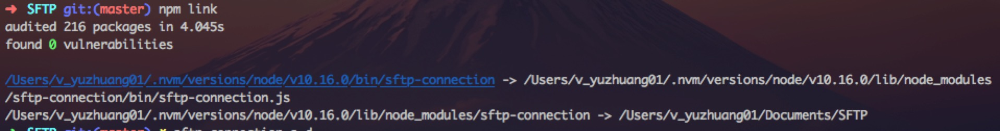

## npm命令
---
### 安装包
| 命令 | 描述 |
| -- | -- |
| `npm install packageName` | 项目内安装 |
| `npm install packageName -g` | 全局安装包 |
| `npm install packageName -S` | 安装依赖项,`-S = --save` |
| `npm install packageName -D` | 安装开发依赖项, `-D = --save-dev` |


`npm install`和`npm ci`的主要区别:
1.该项目必须有一个 package-lock.json 或 npm-shrinkwrap.json.
2.如果package-lock.json中的依赖项与package.json的依赖项不匹配,`npm ci`则将退出并显示错误，而不是更新package-lock.json.
3.`npm ci`只能一次安装整个项目: 使用此命令无法添加单个依赖项.
4.如果node_modules已经存在,它将在`npm ci`开始安装之前自动删除.
5.它永远不会写入 package.json或package-lock.json: 安装基本上是冻结的.


1. 查看npm全局安装的包
`npm list -g --depth 0`
2. root权限npm全局安装,仍会权限不足, --unsafe-perm
`sudo npm install --unsafe-perm=true`
3. 更新包
`npm update`更新全部包(慎用)
`npm update 包名`更新某个包名
`npm update 包名 -g`更新全局的某个包
也可以用install更新包`npm i name@版本号`
4. package.json中^ ~的区别
 - 比如"classnames": "2.2.5"，表示安装2.2.5的版本
 - 比如 "babel-plugin-import": "~1.1.0",表示安装1.1.x的最新版本（不低于1.1.0），但是不安装1.2.x，也就是说安装时不改变大版本号和次要版本号
 - 比如 "antd": "^3.1.4",，表示安装3.1.4及以上的版本，但是不安装4.0.0，也就是说安装时不改变大版本号。
5. 查看npmjs服务器上包的版本信息
```bash
npm view react versions；这种方式可以查看npm服务器上所有的react版本信息；
npm view react version； 这种方式只能查看react的最新的版本是哪一个；
npm info react 这种方式和第一种类似，也可以查看react所有的版本，但是能查出更多的关于react的信息；

2、查看本地已经安装的包的版本信息：
npm ls react （查看某个项目安装的react），命令必须在某个项目下执行
npm ls react -g (查看全局安装的react)
```

#### npm root -g
查看全局包安装的路径.
#### npm bin -g 
查看全局的可执行文件的存放路径.
#### npm link 
开发包的时候,进行本地调试.
在全局的node的bin下添加命令,并且将node_modules中的该包源码指向本地的目录.

#### npm unlink
调试结束后，我们回到开发包的目录,执行`npm unlink`,解除映射关系.
#### npm whoami
查看当前npm用户
#### npm login
登录npm
#### npm config get registry
查看当前registry
## 相关链接
---
[一文为您构建系统化的 NPM 知识！](https://mp.weixin.qq.com/s/RAtoEgZsvpuRwudeUjNKZw)